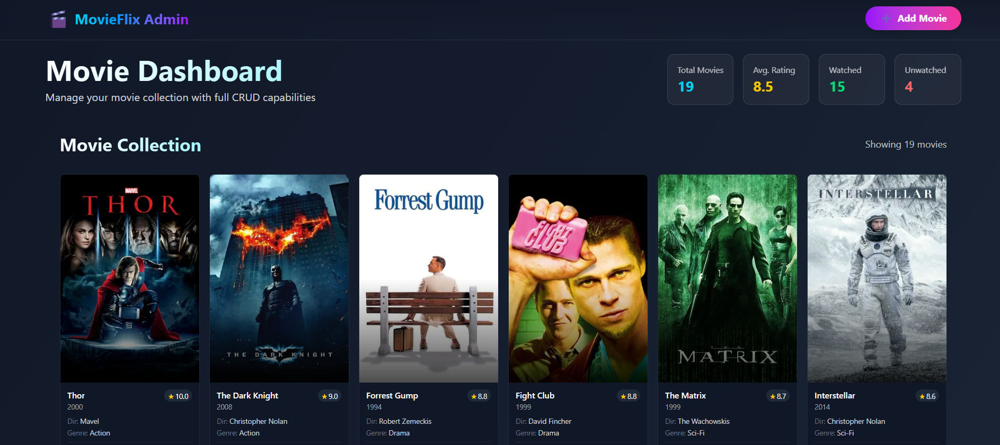

# 🎬 MovieFlix Admin Dashboard - Frontend

A modern responsive admin panel built with **React (Vite)** frontend and **ASP.NET Core Web API** backend. Manage your movie collections with ease — add, edit, delete, and automatically fetch posters from TMDB.

## 🚀 Features
- Responsive design (desktop/tablet/mobile)
- CRUD operations for movies
- Auto-fetch posters from TMDB API
- React Vite + Tailwind CSS frontend
- Secure ASP.NET Core Web API backend

## 🛠 Tech Stack
- Frontend: React, Vite, Tailwind CSS
- Backend: ASP.NET Core, Entity Framework
- API: TMDB (Poster Fetch)
